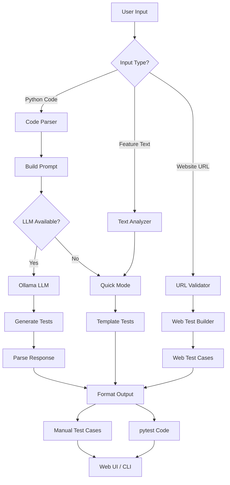
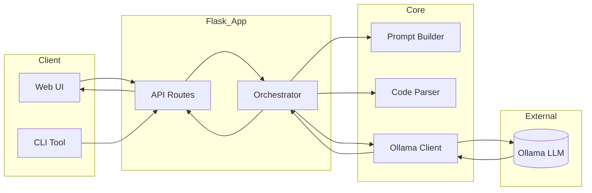

# 🧪 Local Test Case Generator

> **AI-Powered Test Case Generation using Local LLMs (Ollama + Llama 3.2)**

[](https://python.org)
[](https://flask.palletsprojects.com)
[](https://ollama.com)
[](LICENSE)

Generate comprehensive test cases from Python code or feature descriptions **without sending data to external APIs**. Your code stays private and secure! 🔒

<p align="center">
  
  
  
</p>

---

## 📋 Table of Contents

- [🎯 Overview](#-overview)
- [✨ Features](#-features)
- [🚀 Quick Start](#-quick-start)
- [📦 Installation](#-installation)
- [▶️ Usage](#-usage)
- [🏗️ System Architecture](#️-system-architecture)
- [📊 Workflow Diagrams](#-workflow-diagrams)
- [🔌 API Reference](#-api-reference)
- [📁 Project Structure](#-project-structure)
- [🔧 Configuration](#-configuration)
- [🐛 Troubleshooting](#-troubleshooting)
- [🤝 Contributing](#-contributing)
- [📄 License](#-license)

---

## 🎯 Overview

```
┌─────────────────────────────────────────────────────────────────────────────┐
│                                                                             │
│   🐍 Python Code        📝 Feature Text         🌐 Website URL              │
│        │                      │                       │                      │
│        └──────────────────────┼───────────────────────┘                      │
│                               ▼                                             │
│                    ┌─────────────────────┐                                   │
│                    │  Local AI Engine    │                                   │
│                    │  (Ollama + Llama)   │                                   │
│                    └──────────┬──────────┘                                   │
│                               ▼                                             │
│              ┌────────────────────────────────┐                             │
│              │   ✅ Manual Test Cases         │                             │
│              │   ✅ pytest Automation Code    │                             │
│              │   ✅ Edge Cases                │                             │
│              └────────────────────────────────┘                             │
│                                                                             │
└─────────────────────────────────────────────────────────────────────────────┘
```

**Local Test Case Generator** is a privacy-first testing tool that uses local Large Language Models to generate comprehensive test cases. No API keys, no data leaving your machine - just pure local AI power!

---

## ✨ Features

### 🎯 Core Capabilities

| Feature | Input | Output | Speed |
|---------|-------|--------|-------|
| **🐍 Python Code Testing** | `def add(a, b): return a+b` | Manual + pytest | ⚡ Instant |
| **📝 Feature Testing** | "Login with email, password" | Test scenarios | ⚡ Instant |
| **🌐 Website Testing** | "google.com" | UI test cases | ⚡ Instant |
| **🔒 100% Private** | Local processing | No cloud | 🛡️ Secure |

### 🎨 UI Preview

```
┌────────────────────────────────────────────────────────────────────────────┐
│ 🔷 Local Test Case Generator              [🟢 Online] [🤖 Llama 3.2]       │
├────────────────────────────────────────────────────────────────────────────┤
│                                                                            │
│  ┌────────────────────────────────────────────────────────────────────┐   │
│  │ 👋 Hello! I'm your AI Test Engineer.                               │   │
│  │    Paste your Python code or feature description below.            │   │
│  └────────────────────────────────────────────────────────────────────┘   │
│                                                                            │
│  ┌────────────────────────────────────────────────────────────────────┐   │
│  │ def calculate_discount(price, discount_percent):                   │   │
│  │     """Calculate discounted price"""                               │   │
│  │     if price < 0 or discount_percent < 0:                          │   │
│  │         raise ValueError("Negative values not allowed")            │   │
│  │     discount = price * (discount_percent / 100)                    │   │
│  │     return price - discount                                        │   │
│  └────────────────────────────────────────────────────────────────────┘   │
│                                                                            │
│  [🚀 Generate Test Cases]                                                  │
│                                                                            │
├────────────────────────────────────────────────────────────────────────────┤
│ 📋 Generated Test Cases:                                                   │
│ ┌─────────┬──────────────────────────────┬──────────┬──────────────────┐  │
│ │ ID      │ Title                        │ Type     │ Priority         │  │
│ ├─────────┼──────────────────────────────┼──────────┼──────────────────┤  │
│ │ TC_001  │ Valid discount calculation   │ POSITIVE │ High             │  │
│ │ TC_002  │ Negative price validation    │ NEGATIVE │ High             │  │
│ │ TC_003  │ Zero discount edge case      │ BOUNDARY │ Medium           │  │
│ │ TC_004  │ 100% discount (free item)    │ EDGE     │ Medium           │  │
│ └─────────┴──────────────────────────────┴──────────┴──────────────────┘  │
│                                                                            │
│ 🧪 pytest Code:                                                            │
│ ┌────────────────────────────────────────────────────────────────────┐   │
│ │ def test_valid_discount():                                         │   │
│ │     assert calculate_discount(100, 20) == 80                       │   │
│ │                                                                    │   │
│ │ def test_negative_price_raises_error():                            │   │
│ │     with pytest.raises(ValueError):                                │   │
│ │         calculate_discount(-10, 20)                                │   │
│ └────────────────────────────────────────────────────────────────────┘   │
│                                                                            │
└────────────────────────────────────────────────────────────────────────────┘
```

---

## 🚀 Quick Start

### One-Command Start (Windows)
```powershell
.\START.bat
```

### Manual Start
```powershell
# Terminal 1 - Start Ollama
ollama serve

# Terminal 2 - Start Web Server
python deploy.py
```

### Access the App
Open browser: **http://localhost:5000**

<p align="center">
  <b>That's it! Start generating test cases in seconds! 🎉</b>
</p>

---

## 📦 Installation

### Prerequisites

| Requirement | Version | Install Command |
|------------|---------|-----------------|
| Python | 3.8+ | [Download](https://python.org/downloads) |
| Ollama | Latest | [Download](https://ollama.com/download) |
| Llama 3.2 | latest | `ollama pull llama3.2` |

### Step-by-Step Setup

```powershell
# 1. Clone the repository
git clone https://github.com/Qais7744/Local-Testcase-Generation-using-Ollama-Kimi.git
cd Local-Testcase-Generation-using-Ollama-Kimi

# 2. Install Python dependencies
pip install -r requirements.txt

# 3. Pull the LLM model (one-time)
ollama pull llama3.2

# 4. Start the application
.\START.bat
```

### Verify Installation

```powershell
# Check Ollama status
curl http://localhost:11434/api/tags

# Check Web Server
python -c "import requests; print(requests.get('http://localhost:5000/api/health').json())"
```

---

## ▶️ Usage

### 🌐 Web Interface

1. **Open** http://localhost:5000 in your browser
2. **Select Input Type:**
   - 🐍 **Python Code** - Paste function/class code
   - 📝 **Feature Description** - Write plain text requirements
   - 🌐 **Website URL** - Enter domain (e.g., `google.com`)
3. **Click** "Generate" or press `Ctrl + Enter`
4. **View Results:**
   - 📋 Manual Test Cases (TC_001, TC_002...)
   - 🧪 pytest Automation Code

### 💻 Command Line Interface

```powershell
# Generate from Python file
python -m blast_testgen.cli --file my_code.py

# Generate from text
python -m blast_testgen.cli --text "Login with email and password"
```

### 📊 Example Inputs & Outputs

#### Example 1: Python Function
**Input:**
```python
def login(username, password):
    if not username or not password:
        raise ValueError("Username and password required")
    if len(password) < 8:
        raise ValueError("Password must be 8+ characters")
    return {"token": "abc123", "user": username}
```

**Output:**
```
┌─────────────────────────────────────────────────────────────────────────┐
│ 📋 Test Cases Generated: 4                                              │
├─────────────────────────────────────────────────────────────────────────┤
│                                                                         │
│ TC_001: Valid Login (POSITIVE)                                          │
│   Steps: 1. Enter valid username & password (8+ chars)                  │
│          2. Click login                                                 │
│   Expected: Token returned, login successful                            │
│                                                                         │
│ TC_002: Empty Username (NEGATIVE)                                       │
│   Steps: 1. Leave username empty                                        │
│          2. Enter valid password                                        │
│          3. Click login                                                 │
│   Expected: ValueError: "Username and password required"                │
│                                                                         │
│ TC_003: Short Password (NEGATIVE)                                       │
│   Steps: 1. Enter username                                              │
│          2. Enter password "12345" (less than 8 chars)                  │
│   Expected: ValueError: "Password must be 8+ characters"                │
│                                                                         │
│ TC_004: Both Fields Empty (NEGATIVE)                                    │
│   Steps: 1. Leave both fields empty                                     │
│          2. Click login                                                 │
│   Expected: ValueError raised                                           │
│                                                                         │
└─────────────────────────────────────────────────────────────────────────┘
```

#### Example 2: Feature Description
**Input:**
```
Registration page with email, password, confirm password fields.
Email should be valid format. Password must match confirmation.
```

**Output:**
```
┌─────────────────────────────────────────────────────────────────────────┐
│ 📋 Test Cases Generated: 5                                              │
├─────────────────────────────────────────────────────────────────────────┤
│                                                                         │
│ TC_001: Valid Registration (POSITIVE)                                   │
│ TC_002: Invalid Email Format (NEGATIVE)                                 │
│ TC_003: Password Mismatch (NEGATIVE)                                    │
│ TC_004: Empty Required Fields (NEGATIVE)                                │
│ TC_005: Weak Password Validation (NEGATIVE)                             │
│                                                                         │
└─────────────────────────────────────────────────────────────────────────┘
```

---

## 🏗️ System Architecture

### High-Level Architecture

```
┌─────────────────────────────────────────────────────────────────────────────┐
│                           CLIENT LAYER                                      │
│  ┌──────────────┐  ┌──────────────┐  ┌──────────────┐                      │
│  │   Web UI     │  │   CLI Tool   │  │  API Client  │                      │
│  │  (Browser)   │  │  (Terminal)  │  │   (Code)     │                      │
│  └──────┬───────┘  └──────┬───────┘  └──────┬───────┘                      │
└─────────┼─────────────────┼─────────────────┼───────────────────────────────┘
          │                 │                 │
          └─────────────────┼─────────────────┘
                            ▼
┌─────────────────────────────────────────────────────────────────────────────┐
│                          API LAYER (Flask)                                  │
│  ┌───────────────────────────────────────────────────────────────────────┐ │
│  │  Routes                    Controllers               Middleware       │ │
│  │  ───────                   ──────────               ──────────       │ │
│  │  GET  /                    render_template()       CORS               │ │
│  │  GET  /api/health          health_check()          Error Handler      │ │
│  │  POST /api/generate        generate_tests()        Request Validator  │ │
│  └───────────────────────────────────────────────────────────────────────┘ │
└─────────────────────────────────────────────────────────────────────────────┘
          │
          ▼
┌─────────────────────────────────────────────────────────────────────────────┐
│                       BUSINESS LOGIC LAYER                                  │
│  ┌─────────────────┐  ┌─────────────────┐  ┌─────────────────┐             │
│  │   Input Router  │  │  Test Generator │  │  Output Parser  │             │
│  │  ─────────────  │  │  ─────────────  │  │  ─────────────  │             │
│  │  detect_type()  │  │  build_tests()  │  │  parse_json()   │             │
│  │  is_code()      │  │  quick_mode()   │  │  extract_code() │             │
│  │  is_url()       │  │  llm_mode()     │  │  format_output()│             │
│  └────────┬────────┘  └────────┬────────┘  └─────────────────┘             │
│           │                    │                                            │
│           └────────────────────┘                                            │
│                            │                                                │
└────────────────────────────┼────────────────────────────────────────────────┘
                             ▼
┌─────────────────────────────────────────────────────────────────────────────┐
│                      INFRASTRUCTURE LAYER                                   │
│  ┌─────────────────┐  ┌─────────────────┐  ┌─────────────────┐             │
│  │  Ollama Client  │  │  Code Parser    │  │  Prompt Builder │             │
│  │  ─────────────  │  │  ────────────   │  │  ─────────────  │             │
│  │  generate()     │  │  parse_python() │  │  build_prompt() │             │
│  │  is_available() │  │  extract_funcs()│  │  format_json()  │             │
│  │  list_models()  │  │  analyze_code() │  │  template_mgr() │             │
│  └────────┬────────┘  └─────────────────┘  └─────────────────┘             │
│           │                                                                 │
└───────────┼─────────────────────────────────────────────────────────────────┘
            │
            ▼
┌─────────────────────────────────────────────────────────────────────────────┐
│                         LLM LAYER (Local)                                   │
│  ┌───────────────────────────────────────────────────────────────────────┐ │
│  │                                                                       │ │
│  │    ┌───────────────┐          ┌───────────────┐                      │ │
│  │    │   Ollama      │◄────────►│  Llama 3.2    │                      │ │
│  │    │   Server      │          │    Model      │                      │ │
│  │    │   :11434      │          │               │                      │ │
│  │    └───────────────┘          └───────────────┘                      │ │
│  │                                                                       │ │
│  └───────────────────────────────────────────────────────────────────────┘ │
└─────────────────────────────────────────────────────────────────────────────┘
```

### B.L.A.S.T. Protocol

This project follows the **B.L.A.S.T.** methodology:

```
┌─────────────────────────────────────────────────────────────────┐
│                                                                 │
│     B ────────► L ────────► A ────────► S ────────► T          │
│     │           │           │           │           │          │
│  Blueprint    Link      Architect    Stylize     Trigger       │
│     │           │           │           │           │          │
│  Planning   Connectivity   Build      Refine    Deploy         │
│     │           │           │           │           │          │
│   Design     Test APIs   3-Layer      UI/UX   Production       │
│     │           │        System      Polish    Launch          │
│     │           │           │           │           │          │
│  task_plan   verify_    web_app     style.css   deploy.py      │
│  gemini.md   ollama.py  templates   chat.js    waitress        │
│                                                                 │
└─────────────────────────────────────────────────────────────────┘
```

---

## 📊 Workflow Diagrams

### Data Flow Diagram



### Component Interaction



### Request Lifecycle

```
┌────────┐     ┌────────┐     ┌────────┐     ┌────────┐     ┌────────┐
│        │     │        │     │        │     │        │     │        │
│ User   │────►│ Flask  │────►│ Router │────►│ LLM    │────►│ Output │
│ Request│     │ App    │     │ Logic  │     │ Engine │     │ Response│
│        │     │        │     │        │     │        │     │        │
└────────┘     └────────┘     └────────┘     └────────┘     └────────┘
     │              │              │              │              │
     │              │              │              │              │
     ▼              ▼              ▼              ▼              ▼
  POST /api    Parse JSON    Detect Type    Generate       Format JSON
  /generate    Validate      Build Prompt   Test Cases     Return Result
```

---

## 🔌 API Reference

### Health Check
```powershell
GET /api/health
```
```json
{
  "status": "healthy",
  "ollama_connected": true,
  "model": "llama3.2",
  "available_models": ["llama3.2:latest"]
}
```

### Generate Test Cases
```powershell
POST /api/generate
Content-Type: application/json

{
  "code": "def add(a, b): return a + b"
}
```

**Response:**
```json
{
  "success": true,
  "test_cases": [
    {
      "id": "TC_001",
      "title": "Valid addition with positive numbers",
      "type": "POSITIVE",
      "steps": ["Call add(2, 3)"],
      "expected": "Returns 5"
    }
  ],
  "pytest_code": "def test_add(): assert add(2, 3) == 5",
  "model_used": "llama3.2"
}
```

### Python API Client Example
```python
import requests

# Generate tests
response = requests.post(
    'http://localhost:5000/api/generate',
    json={'code': 'def divide(a, b): return a / b'}
)

result = response.json()
print(result['test_cases'])      # Manual test cases
print(result['pytest_code'])     # Automation code
```

---

## 📁 Project Structure

```
Local-Testcase-Generation-using-Ollama-Kimi/
│
├── 📄 README.md                 # This file
├── 📄 requirements.txt          # Python dependencies
├── 📄 SETUP_GUIDE.md           # Detailed setup instructions
├── 📄 DEPLOYMENT.md            # Production deployment guide
├── 📄 BLAST.md                 # B.L.A.S.T. protocol documentation
│
├── 🚀 Quick Start Scripts
│   ├── START.bat               # One-click Windows start
│   ├── start_server.bat        # Server starter
│   ├── start_background.vbs    # Background mode (no window)
│   └── setup_autostart.bat     # Windows boot setup
│
├── 📦 Main Package (blast_testgen/)
│   ├── __init__.py
│   ├── web_app.py              # Flask web application
│   ├── ollama_client.py        # Ollama LLM client
│   ├── orchestrator.py         # Business logic orchestrator
│   ├── code_parser.py          # Python code analyzer
│   ├── prompts.py              # LLM prompt templates
│   ├── cli.py                  # Command-line interface
│   │
│   ├── 🎨 static/              # CSS, JS assets
│   │   ├── style.css
│   │   └── chat.js
│   │
│   └── 🖼️ templates/           # HTML templates
│       └── chat.html
│
├── 🛠️ Tools (tools/)
│   ├── verify_ollama.py        # Ollama connection checker
│   ├── generate_tests.py       # Standalone test generator
│   └── validate_code.py        # Code validation utility
│
├── 📋 Architecture (architecture/)
│   ├── SOP-001-TestGeneration.md
│   ├── SOP-002-CodeValidation.md
│   └── SOP-003-OllamaIntegration.md
│
├── ⚛️ Frontend (frontend/)
│   ├── src/
│   │   ├── components/         # React components
│   │   ├── pages/              # Page components
│   │   └── services/           # API services
│   └── public/
│
├── 🧪 Tests (tests/)           # Sample test files
├── 🔧 Configs
│   ├── deploy.py               # Production server
│   ├── run_web.py              # Development server
│   └── run.py                  # Simple runner
│
└── 📁 .tmp/                    # Temporary files
```

---

## 🔧 Configuration

### Environment Variables
```powershell
# Optional: Set custom Ollama host
$env:OLLAMA_HOST="http://localhost:11434"

# Optional: Set default model
$env:DEFAULT_MODEL="llama3.2"
```

### Custom Port
```powershell
# Run on port 8080
python deploy.py --port 8080
```

### Network Access
```powershell
# Allow access from other devices
python deploy.py --host 0.0.0.0
```

### Change Model
Edit `blast_testgen/ollama_client.py`:
```python
DEFAULT_MODEL = "gemma3:1b"  # Lighter/faster model
```

---

## 🐛 Troubleshooting

### Common Issues

| Issue | Cause | Solution |
|-------|-------|----------|
| `Ollama not available` | Ollama not running | Run `ollama serve` |
| `Module not found` | Missing dependencies | Run `pip install -r requirements.txt` |
| `Port 5000 in use` | Another service running | Kill process or use different port |
| `Generation timeout` | Input too complex | Use shorter input or simpler code |
| `Model not found` | Model not pulled | Run `ollama pull llama3.2` |
| `Slow generation` | Large input or slow CPU | Use lighter model like `gemma3:1b` |

### Stop Server

```powershell
# Method 1: Terminal (Recommended)
# Press Ctrl+C in the terminal

# Method 2: PowerShell
$port = 5000
$proc = Get-NetTCPConnection -LocalPort $port -ErrorAction SilentlyContinue | Select-Object -ExpandProperty OwningProcess
if ($proc) { taskkill /F /PID $proc }

# Method 3: Kill all Python
Stop-Process -Name python -Force
```

### Check Logs
```powershell
# Server logs appear in terminal
# For detailed debugging:
python deploy.py --threads 1
```

---

## 🤝 Contributing

We welcome contributions! Please follow these steps:

1. **Fork** the repository
2. **Create** a feature branch: `git checkout -b feature/amazing-feature`
3. **Commit** changes: `git commit -m 'Add amazing feature'`
4. **Push** to branch: `git push origin feature/amazing-feature`
5. **Open** a Pull Request

### Development Setup
```powershell
# Install dev dependencies
pip install -r requirements.txt
pip install pytest black flake8

# Run tests
pytest tests/

# Format code
black blast_testgen/
```

---

## 📄 License

This project is licensed under the **MIT License** - see the [LICENSE](LICENSE) file for details.

```
MIT License

Copyright (c) 2024 Local Test Case Generator

Permission is hereby granted, free of charge, to any person obtaining a copy
of this software and associated documentation files (the "Software"), to deal
in the Software without restriction, including without limitation the rights
to use, copy, modify, merge, publish, distribute, sublicense, and/or sell
copies of the Software, and to permit persons to whom the Software is
furnished to do so, subject to the following conditions:

The above copyright notice and this permission notice shall be included in all
copies or substantial portions of the Software.
```

---

## 🙏 Acknowledgments

- **[Ollama](https://ollama.com)** - For making local LLMs accessible
- **[Llama 3.2](https://ai.meta.com/llama/)** - Meta's open-source LLM
- **[Flask](https://flask.palletsprojects.com)** - Lightweight web framework
- **[pytest](https://pytest.org)** - Python testing framework

---

<p align="center">
  <b>Made with ❤️ using Local AI</b><br>
  <sub>Keep your code private. Test smarter. 🚀</sub>
</p>

---

## 📞 Support

- 📧 **Issues:** [GitHub Issues](https://github.com/Qais7744/Local-Testcase-Generation-using-Ollama-Kimi/issues)
- 📖 **Documentation:** Check `SETUP_GUIDE.md` and `DEPLOYMENT.md`
- 💬 **Discussions:** [GitHub Discussions](https://github.com/Qais7744/Local-Testcase-Generation-using-Ollama-Kimi/discussions)
